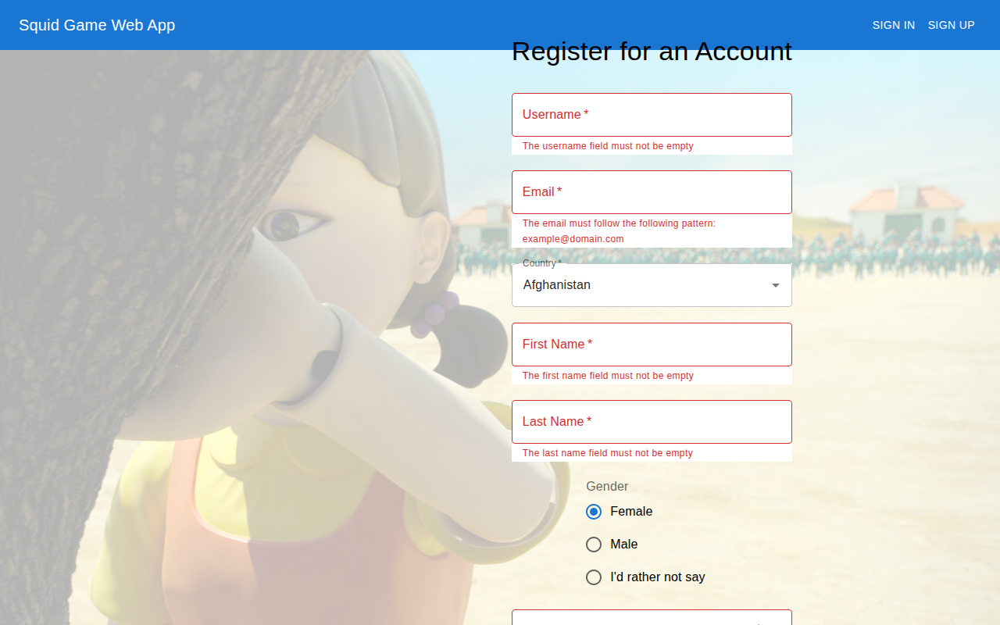
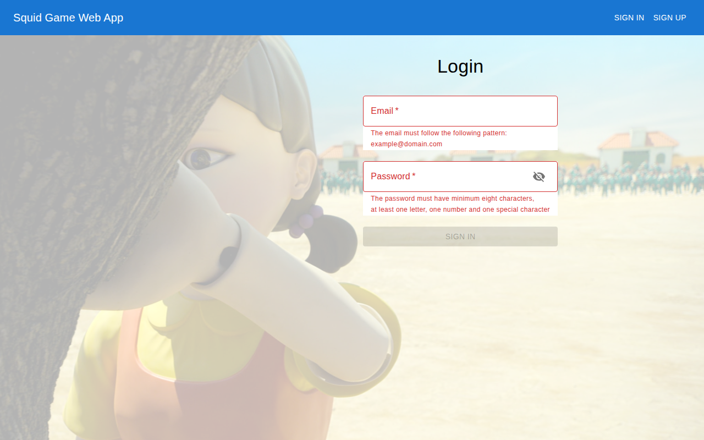

# Squid Game web app

> **Original version:** this README and some fixes were added in 2026. To see the project exactly as it was first built, browse commit [`e277fd3`](https://github.com/dianapaula19/squid-game-web-app/tree/e277fd34b4a8da82c99cd650fec13a8695c7aab5) (2022-02-01).

A web app set in the world of *Squid Game*: sign up as a **player** (green tracksuit) or a
**guard** (red), log in with JWT authentication, and see your profile. The *Red Light, Green
Light* game page (`GamePage.tsx`) was started but is not linked into the app yet.
Built in winter 2021–2022.

| Choose a side and register | Log in |
|---|---|
|  |  |

## Stack

- **Backend** (`backend/`): ASP.NET Core 5 Web API, Entity Framework Core with SQL Server,
  ASP.NET Identity, JWT access and refresh tokens, repository + unit-of-work pattern, Swagger
- **Frontend** (`frontend/`): React 17, TypeScript, Redux Toolkit, Material UI

## Running

Backend (needs the .NET 5 SDK and a SQL Server instance, e.g. the `mcr.microsoft.com/mssql/server`
Docker image; the connection string is in `backend/appsettings.json`):

```bash
cd backend
dotnet user-secrets init
dotnet user-secrets set "JwtConfig:Secret" "$(openssl rand -hex 32)"
dotnet ef database update
dotnet run
```

Frontend:

```bash
cd frontend
npm ci
npm start        # http://localhost:3000
```
